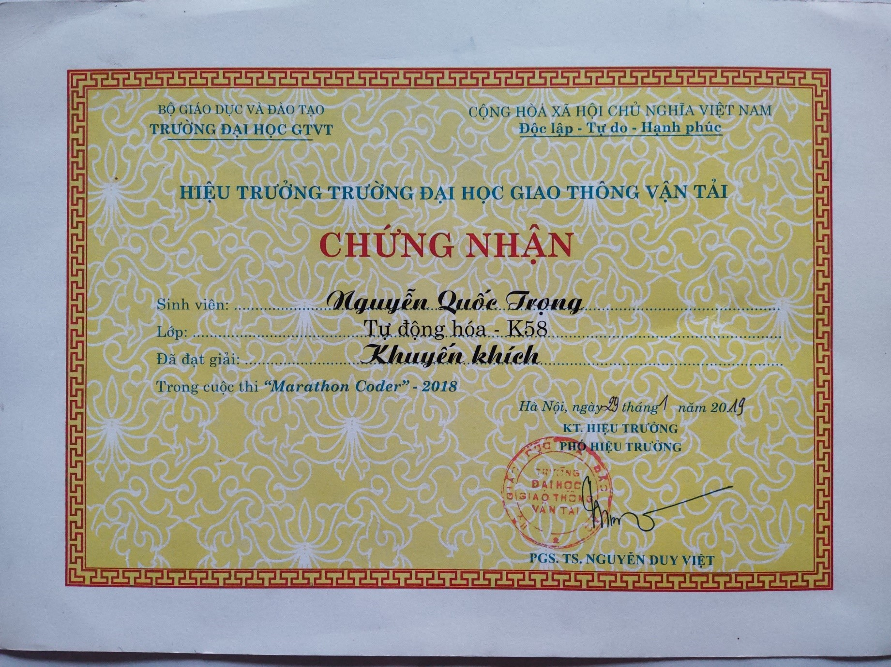
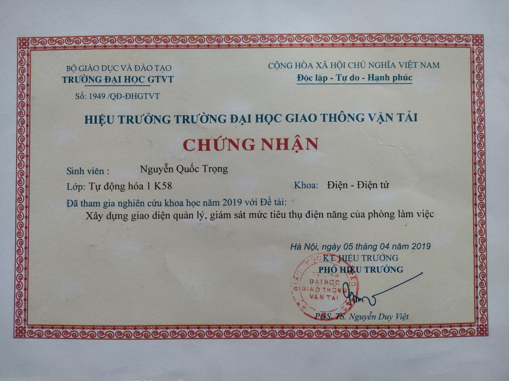
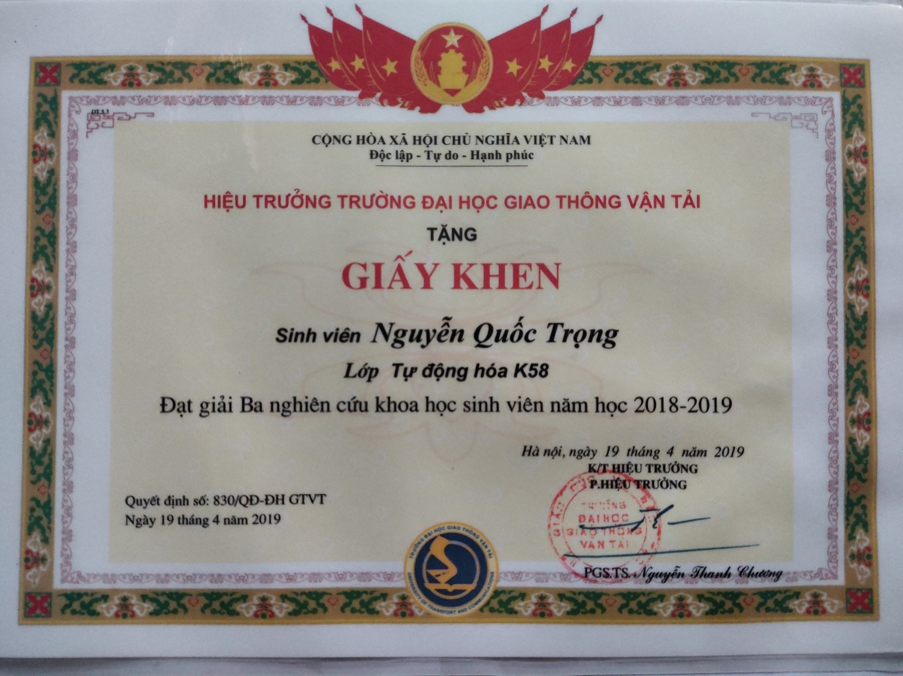
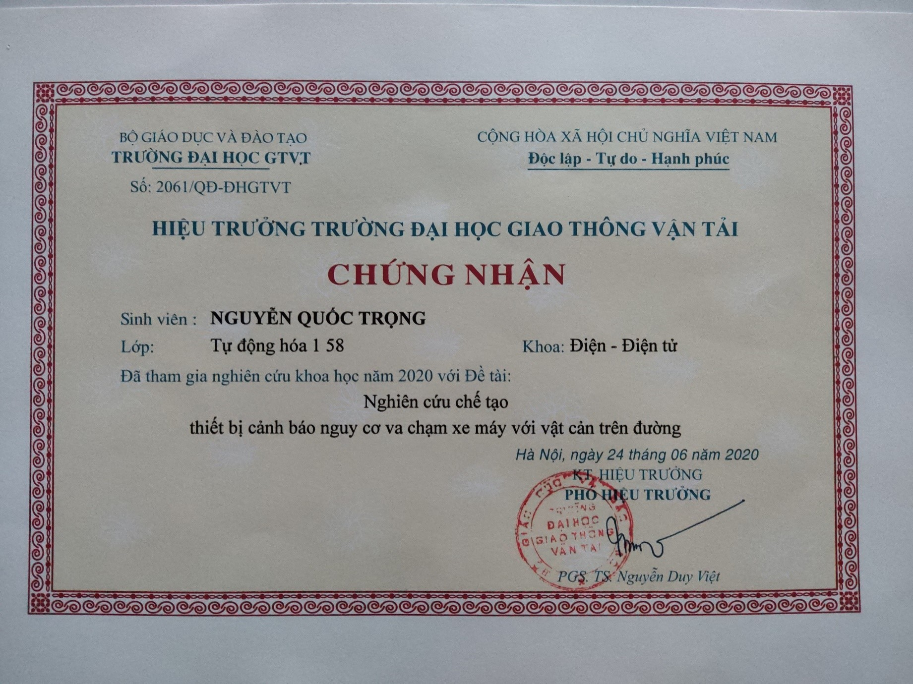
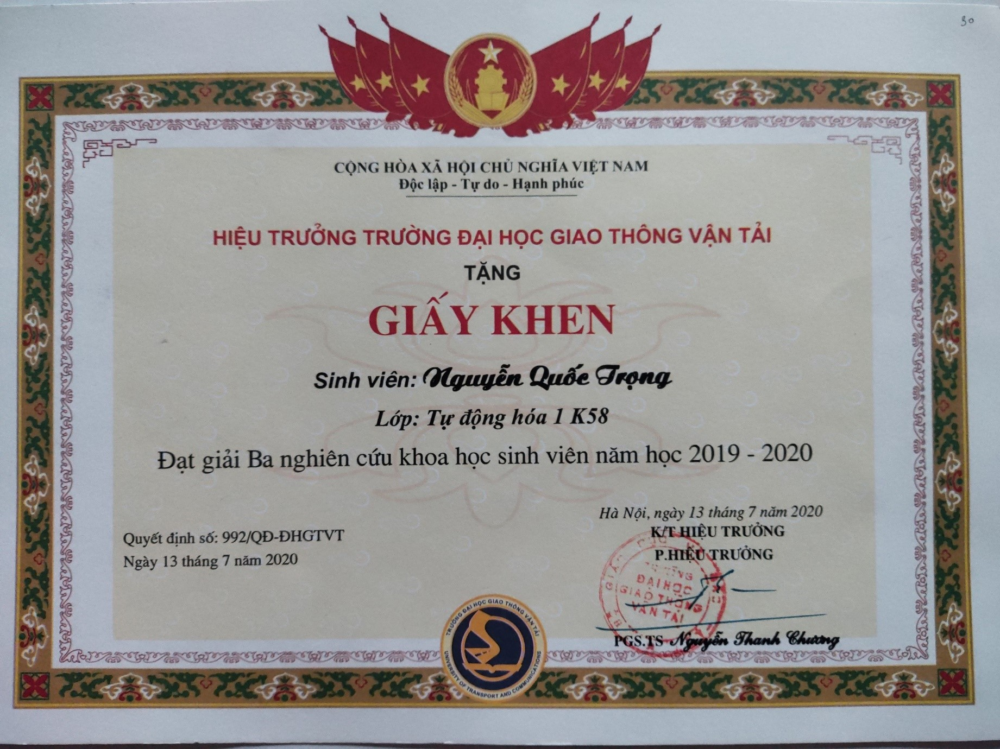
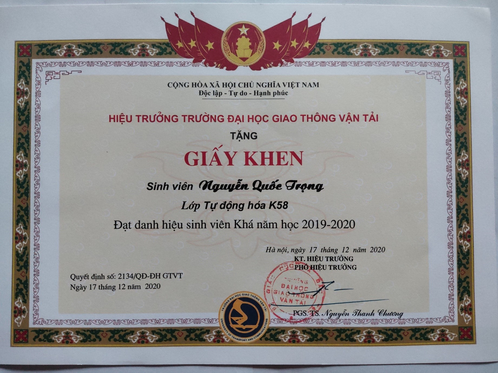

<head>

</head>

<h2 align="center" style="font-weight: bold">💎 INTRODUCE 💎</h2>
  

    

      &nbsp;&nbsp;&nbsp;&nbsp;Nguyen Quoc Trong

    

    

      &nbsp;&nbsp;&nbsp;&nbsp;Vinh Bao, Hai Phong, Viet Nam

    

    

      &nbsp;&nbsp;&nbsp;&nbsp;14/09/1999

    

    

      &nbsp;&nbsp;&nbsp;&nbsp;0988428129

    

    

      &nbsp;&nbsp;&nbsp;&nbsp;nguyenquoctronghp@gmail.com

    

  

<h2 align="center"style="font-weight: bold">🎯 OBJECTIVE 🎯</h2>
    

      
As an engineer specializing in control and automation, I want to apply the knowledge I have accumulated in factories with the goal of modernizing production lines and improving production quality.

    

<h2 align="center" style="font-weight: bold">🏫 EDUCATION 🏫</h2>
    

      <h3 style="font-weight: bold">08/2017 – 12/2021: University of Transport and Communications Ha Noi</h3>
      

      <strong>Major:</strong> Control Engineering and Automation
      &nbsp;&nbsp;&nbsp;&nbsp;&nbsp;&nbsp;&nbsp;&nbsp;<strong>Diploma:</strong> Engineer

      
<strong>Classification:</strong> Good
      &nbsp;&nbsp;&nbsp;&nbsp;&nbsp;&nbsp;&nbsp;&nbsp;&nbsp;&nbsp;&nbsp;&nbsp;&nbsp;&nbsp;&nbsp;&nbsp;&nbsp;&nbsp;&nbsp;&nbsp;&nbsp;&nbsp;&nbsp;&nbsp;&nbsp;&nbsp;&nbsp;&nbsp;&nbsp;&nbsp;&nbsp;&nbsp;&nbsp;&nbsp;&nbsp;&nbsp;&nbsp;&nbsp;&nbsp;&nbsp;&nbsp;&nbsp;&nbsp;&nbsp;&nbsp;&nbsp;&nbsp;<strong>Accumulated points:</strong> 7.64/10

    

    

      <h3 style="font-weight: bold">01/2019: Won consolation prize in “Marathon Coder” contest 2018</h3>
      
&nbsp;&nbsp;&nbsp;&nbsp;&nbsp;Algorithm programming contest. That was the beginning of my passion for programming.

    

    

      <h3 style="font-weight: bold">07/2019: Won the third prize for scientific research in the academic year 2018 – 2019</h3>
      
&nbsp;&nbsp;&nbsp;&nbsp;&nbsp;Project title: Building a management interface to monitor the power consumption of the working room.

    

    

      <h3 style="font-weight: bold">06/2020: Won the third prize for scientific research in the academic year 2019 – 2020</h3>
      
&nbsp;&nbsp;&nbsp;&nbsp;&nbsp;Project title: Research and manufacture a device to warn of the risk of motorcycle collisions with obstacles on the road.

    

    

      <h3 style="font-weight: bold">07/2021: Won the second prize for scientific research in the academic year 2020 – 2021</h3>
      
&nbsp;&nbsp;&nbsp;&nbsp;&nbsp;Project title: Research on building a smart wastewater monitoring system.

    

<h2 align="center" style="font-weight: bold">🏢 WORK EXPERIENCE 🏢</h2>
    

      <h3 style="font-weight: bold">02/2019 - 03/2020: VINH QUANG GROUP </h3>
      
<strong>Position:</strong> Part-time job

      
<strong>Description:</strong>

      
&nbsp;&nbsp;&nbsp;&nbsp;- Assembling components, soldering electronic circuits.

      
&nbsp;&nbsp;&nbsp;&nbsp;- Assembling and connecting industrial electrical practice models.

      
&nbsp;&nbsp;&nbsp;&nbsp;- Participating in the handover work and guiding teachers to use electric practice models.

    

    

      <h3 style="font-weight: bold">05/2021 - 09/2022: LEANWAY EQUIPMENT AND TECHNOLOGY JOIN STOCK COMPANY</h3>
      
<strong>Position:</strong> Design Engineer

      
<strong>Description:</strong>

      
&nbsp;&nbsp;&nbsp;&nbsp;- Automation solutions according to customer requirements: SONHA CORPORATION., JSC and MUTOSI GROUP., JSC.

      
&nbsp;&nbsp;&nbsp;&nbsp;- Design electrical drawings of electrical cabinets, electrical machines to support industrial production.

      
&nbsp;&nbsp;&nbsp;&nbsp;- Guide and check the process of installation and connection of electrical cabinets and machines.

      
&nbsp;&nbsp;&nbsp;&nbsp;- Programming PLCs of Siemens, Delta, Mitsubishi.

      
&nbsp;&nbsp;&nbsp;&nbsp;- Writing machine manuals.

      
&nbsp;&nbsp;&nbsp;&nbsp;- Technology transfer to engineers at factories of SONHA CORPORATION., JSC and MUTOSI GROUP., JSC.

      
&nbsp;&nbsp;&nbsp;&nbsp;- Participate in research and development of expansion modules for PLC.

      
&nbsp;&nbsp;&nbsp;&nbsp;- Manage the company's data storage system and internet of LEANWAY., JSC.

    

<h2 align="center" style="font-weight: bold">💎 SPECIALIZED SKILLS 💎</h2>
    

      
&nbsp;&nbsp;&nbsp;&nbsp;- Good teamwork skills.

      
&nbsp;&nbsp;&nbsp;&nbsp;- Good computer skills.

      
&nbsp;&nbsp;&nbsp;&nbsp;- Good English reading and comprehension skills.

      
&nbsp;&nbsp;&nbsp;&nbsp;- Good at C, C#, SQL programming languages.

      
&nbsp;&nbsp;&nbsp;&nbsp;- Good at ADO.NET, Entity Framework.

      
&nbsp;&nbsp;&nbsp;&nbsp;- Good at programming micro controller units STM32.

      
&nbsp;&nbsp;&nbsp;&nbsp;- Good at programming PLC/HMI (Siemens, Delta).

      
&nbsp;&nbsp;&nbsp;&nbsp;- Good use of programming software: TiaPortal, Visual Code, Visual Studio, KeliC, Arduino.

      
&nbsp;&nbsp;&nbsp;&nbsp;- Good use of design software: Eplan Electric, AutoCAD, Altium Designer.

    

<h2 align="center" style="font-weight: bold">❤️ INTERESTS ❤️</h2>
    

      
&nbsp;&nbsp;&nbsp;&nbsp;- Write code.

      
&nbsp;&nbsp;&nbsp;&nbsp;- Listen to music.

      
&nbsp;&nbsp;&nbsp;&nbsp;- Travel.

      
&nbsp;&nbsp;&nbsp;&nbsp;- Grestaurant business.

    

<h2 align="center" style="font-weight: bold">❗REFER❗</h2>
    

      <h3 style="font-weight: bold">Prof.Dr Trinh Luong Mien</h3>
      
&nbsp;&nbsp;&nbsp;&nbsp;- Dean of Faculty of Electrical of University of Transport and Communications Ha Noi

      
&nbsp;&nbsp;&nbsp;&nbsp;- Phone: 0904684595

      
&nbsp;&nbsp;&nbsp;&nbsp;- Email: mientl@utc.edu.vn

    

    

      <h3 style="font-weight: bold">Mr. Vu Huy Du</h3>
      
&nbsp;&nbsp;&nbsp;&nbsp;- Head of Electrical Engineering Department of Vinh Quang Group

      
&nbsp;&nbsp;&nbsp;&nbsp;- Phone: 0943627288

      
&nbsp;&nbsp;&nbsp;&nbsp;- Email: huydu19586@gmail.com

    

    

      <h3 style="font-weight: bold">Mr. Do Van Duc</h3>
      
&nbsp;&nbsp;&nbsp;&nbsp;- Head of Technical Department of Leanway Equipment and Technology,. JSC

      
&nbsp;&nbsp;&nbsp;&nbsp;- Phone: 0974225660

      
&nbsp;&nbsp;&nbsp;&nbsp;- Email: duc.dv@leanway.vn

    

<h2 align="center" style="font-weight: bold">📖 PERSONAL ACHIEVEMENTS 📖</h2>
    
<body>
    

        
        
Won consolation prize in “Marathon Coder” contest 2018

    

    

        
        
Certificate of participation in scientific research for students in 2018 - 2019

    

    

        
        
Won the third prize for scientific research in the academic year 2018 – 2019

    

    

        
        
Certificate of participation in scientific research for students in 2018 - 2019 2019 - 2020

    

    

        
        
Won the third prize for scientific research in the academic year 2019 – 2020

    

    

        
        
Certificate of merit for good students in the school year 2019 - 2020

    

    

        
        
Certificate of participation in scientific research for students in 2020 -2021

    

    

        
        
Won the second prize for scientific research in the academic year 2020 – 2021

    

</body>

